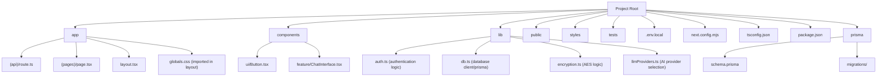

# Next.js Project Architecture Document

## 1. Structure des dossiers et fichiers



*   **`/app`**: Next.js App Router.
    *   **`(api)`**: API routes (e.g., `/app/(api)/messages/route.ts`).
    *   **`(pages)`**: Page routes (e.g., `/app/(pages)/dashboard/page.tsx`).
    *   **`layout.tsx`**: Root layout.
    *   **`globals.css`**: Global styles, imported into `layout.tsx`.
*   **`/components`**: Shared React components.
    *   **`ui/`**: Basic UI elements (e.g., `Button.tsx`, `Input.tsx`).
    *   **`feature/`**: More complex, feature-specific components (e.g., `ChatInterface.tsx`).
*   **`/lib`**: Utility functions, helper modules, and core logic.
    *   `auth.ts`: Authentication and authorization logic.
    *   `db.ts`: Database client setup (e.g., Prisma client for SQLite).
    *   `encryption.ts`: AES encryption/decryption helpers.
    *   `llmProviders.ts`: Logic for selecting and interacting with AI providers.
*   **`/public`**: Static assets (images, fonts, etc.).
*   **`/styles`**: Global styles or Tailwind CSS base/plugin configurations. (Often `globals.css` in `/app` is sufficient with Tailwind).
*   **`/prisma`**: Prisma ORM files.
    *   `schema.prisma`: Defines database schema.
    *   `migrations/`: Database migration files generated by Prisma.
*   **`/tests`**: Unit and integration tests (e.g., using Jest/React Testing Library).
*   **`.env.local`**: Environment variables (API keys, database URLs - **NEVER commit**).
*   **`next.config.mjs`**: Next.js configuration.
*   **`tsconfig.json`**: TypeScript configuration.
*   **`package.json`**: Project dependencies and scripts.

## 2. Modèle de données et choix du store

*   **Choix du Store**: **SQLite** (via Prisma ORM for simplicity and ease of setup).
*   **Modèle de Données (`schema.prisma`)**:

    ```prisma
    // This is your Prisma schema file,
    // learn more about it in the docs: https://pris.ly/d/prisma-schema

    generator client {
      provider = "prisma-client-js"
    }

    datasource db {
      provider = "sqlite"
      url      = env("DATABASE_URL") // e.g., "file:./dev.db"
    }

    model User {
      id            String          @id @default(cuid())
      email         String          @unique
      hashedPassword String? // For credential-based auth
      createdAt     DateTime        @default(now())
      updatedAt     DateTime        @updatedAt
      conversations Conversation[]
      apiKeys       UserApiKey[]
      // Add other user-specific fields as needed (e.g., name, provider, providerAccountId for OAuth)
    }

    model Conversation {
      id        String    @id @default(cuid())
      userId    String
      title     String?   // Optional title for the conversation
      createdAt DateTime  @default(now())
      updatedAt DateTime  @updatedAt
      user      User      @relation(fields: [userId], references: [id], onDelete: Cascade)
      messages  Message[]
    }

    model Message {
      id             String       @id @default(cuid())
      conversationId String
      content        String       // Encrypted message content
      sender         SenderType   // "USER" or "AI"
      aiProvider     String?      // e.g., "OpenAI", "Anthropic"
      timestamp      DateTime     @default(now())
      conversation   Conversation @relation(fields: [conversationId], references: [id], onDelete: Cascade)
    }

    enum SenderType {
      USER
      AI
    }

    model UserApiKey {
      id           String @id @default(cuid())
      userId       String
      providerName String // e.g., "OpenAI", "Anthropic"
      encryptedKey String // Encrypted API key
      createdAt    DateTime @default(now())
      updatedAt    DateTime @updatedAt
      user         User     @relation(fields: [userId], references: [id], onDelete: Cascade)

      @@unique([userId, providerName]) // User can have one key per provider
    }
    ```

## 3. Schéma des API Routes (Next.js App Router - Route Handlers)

Located in `/app/(api)/.../route.ts`

*   **a. Gestion des messages (lecture/écriture historique)**
    *   `POST /api/messages`: Create a new message in a conversation.
        *   Request Body: `{ conversationId?: string, content: string, aiProvider?: string }`
        *   Response: `{ message: Message }` or `{ conversation: Conversation, message: Message }` (if new conversation)
    *   `GET /api/conversations`: Get all conversations for the authenticated user.
        *   Response: `{ conversations: Conversation[] }`
    *   `GET /api/conversations/[conversationId]/messages`: Get messages for a specific conversation.
        *   Response: `{ messages: Message[] }`
*   **b. Sélecteur dynamique de fournisseur IA**
    *   This is primarily handled on the backend within the message creation logic. The client might send a preference.
    *   `POST /api/messages` (as above): The `aiProvider` field in the request can indicate user preference. The backend logic in `/lib/llmProviders.ts` will use this or a default.
*   **c. Gestion des clés API chiffrées et rotation**
    *   `POST /api/user/apikeys`: Add/Update an encrypted API key for a provider for the authenticated user.
        *   Request Body: `{ providerName: string, apiKey: string }`
        *   Response: `{ success: true }`
    *   `GET /api/user/apikeys`: List providers for which the user has configured keys (names only, not keys).
        *   Response: `{ configuredProviders: string[] }`
    *   `DELETE /api/user/apikeys/[providerName]`: Delete an API key for a provider.
        *   Response: `{ success: true }`
    *   Rotation: Manual via update. Automated rotation is complex and might be out of scope for an initial simple setup. If needed, it would involve scheduled jobs and secure key management services.

## 4. Stratégie de chiffrement AES et coffre à secrets

*   **Chiffrement AES**:
    *   Utiliser `AES-256-GCM` pour le chiffrement des messages et des clés API utilisateur stockées en base.
    *   La clé de chiffrement principale (`ENCRYPTION_KEY`) sera stockée comme variable d'environnement.
    *   Un Initialization Vector (IV) unique sera généré pour chaque chiffrement et stocké avec le texte chiffré (souvent préfixé ou stocké dans une colonne séparée).
    *   La logique de chiffrement/déchiffrement sera dans `/lib/encryption.ts`.
*   **Coffre à secrets**:
    *   **Variables d'environnement**:
        *   `DATABASE_URL`: Pour l'URL de la base de données SQLite.
        *   `ENCRYPTION_KEY`: Clé secrète de 32 bytes pour le chiffrement AES. **Générer de manière sécurisée et NE PAS la coder en dur.**
        *   `NEXTAUTH_SECRET`: Pour NextAuth.js.
        *   `NEXTAUTH_URL`: URL de l'application.
        *   `GITHUB_ID`, `GITHUB_SECRET`: Pour l'authentification GitHub OAuth (si utilisée).
        *   Optionnel: `OPENAI_API_KEY_SERVER`, `ANTHROPIC_API_KEY_SERVER` etc. pour les clés API globales du serveur si l'application fournit un accès mutualisé en plus des clés utilisateur.
    *   **Intégration pour la production**:
        *   **Vercel**: Utiliser les variables d'environnement de Vercel.
        *   **AWS**:
            *   **AWS Secrets Manager**: Pour stocker `ENCRYPTION_KEY`, clés API serveur, `DATABASE_URL` (si RDS est utilisé à la place de SQLite en prod).
            *   **AWS Key Management Service (KMS)**: Peut être utilisé pour chiffrer les secrets dans Secrets Manager et pour le chiffrement/déchiffrement des données si une solution plus robuste qu'une simple variable d'environnement pour `ENCRYPTION_KEY` est requise.
            *   L'application récupérera ces secrets au démarrage ou via un SDK AWS.

## 5. Contrôles d’accès (authentification/autorisation)

*   **Authentification**:
    *   Utiliser **NextAuth.js** (`/lib/auth.ts` et `app/(api)/auth/[...nextauth]/route.ts`).
    *   Fournisseurs recommandés :
        *   OAuth (ex: Google, GitHub) pour une intégration facile.
        *   Credentials (email/password) si nécessaire, avec stockage sécurisé des mots de passe (hachage avec salt).
*   **Autorisation**:
    *   Les API routes et les Server Components vérifieront l'identité de l'utilisateur via `getServerSession` de NextAuth.js.
    *   Les opérations sur les données (messages, conversations, clés API) seront filtrées par `userId` pour s'assurer que les utilisateurs ne peuvent accéder qu'à leurs propres données.
    *   Exemple dans une API route:
        ```typescript
        // app/(api)/messages/route.ts
        import { getServerSession } from "next-auth/next";
        import { authOptions } from "@/lib/auth"; // Votre configuration NextAuth
        import { NextResponse } from "next/server";
        import prisma from "@/lib/db";

        export async function POST(request: Request) {
          const session = await getServerSession(authOptions);
          if (!session || !session.user?.id) {
            return NextResponse.json({ error: "Unauthorized" }, { status: 401 });
          }
          const userId = session.user.id;
          // ... logique de création de message associée à userId
        }
        ```

## 6. Pipeline CI/CD GitHub Actions

Fichier: `.github/workflows/ci-cd.yml`

```yaml
name: CI/CD Pipeline

on:
  push:
    branches:
      - main
      - develop
  pull_request:
    branches:
      - main
      - develop

jobs:
  test-and-build:
    runs-on: ubuntu-latest
    strategy:
      matrix:
        node-version: [18.x, 20.x] # Test on relevant Node versions

    steps:
      - name: Checkout code
        uses: actions/checkout@v4

      - name: Set up Node.js ${{ matrix.node-version }}
        uses: actions/setup-node@v4
        with:
          node-version: ${{ matrix.node-version }}
          cache: 'npm'

      - name: Install dependencies
        run: npm ci

      - name: Lint code
        run: npm run lint # Assumes you have a lint script (e.g., ESLint)

      - name: Run tests
        run: npm test # Assumes you have a test script (e.g., Jest)
        env:
          DATABASE_URL: "file:./test.db" # Use a test DB for CI
          ENCRYPTION_KEY: ${{ secrets.TEST_ENCRYPTION_KEY }} # Use a dummy or test key from GitHub secrets
          NEXTAUTH_SECRET: ${{ secrets.TEST_NEXTAUTH_SECRET }}
          NEXTAUTH_URL: "http://localhost:3000"

      - name: Build project
        run: npm run build
        env: # Similar env vars as tests, ensure build completes
          DATABASE_URL: "file:./test.db"
          ENCRYPTION_KEY: ${{ secrets.TEST_ENCRYPTION_KEY }}
          NEXTAUTH_SECRET: ${{ secrets.TEST_NEXTAUTH_SECRET }}
          NEXTAUTH_URL: "http://localhost:3000"
          # For Vercel, actual production env vars are set in Vercel dashboard

  deploy-vercel:
    needs: test-and-build
    if: github.ref == 'refs/heads/main' && github.event_name == 'push' # Deploy only on push to main
    runs-on: ubuntu-latest
    steps:
      - name: Checkout code
        uses: actions/checkout@v4

      # Potentially build and deploy to Vercel using Vercel CLI or GitHub Action for Vercel
      # Vercel typically auto-deploys from connected GitHub repos, so this step might just be for notifications
      # or if a more complex build/deploy process is needed before Vercel takes over.
      # For simple Vercel deploys, connecting the GitHub repo to Vercel is often enough.
      # Example using Vercel CLI (if needed):
      # - name: Install Vercel CLI
      #   run: npm install -g vercel
      # - name: Deploy to Vercel
      #   run: vercel --prod --token ${{ secrets.VERCEL_TOKEN }} --scope <your-vercel-scope>
      # Ensure VERCEL_TOKEN and VERCEL_ORG_ID, VERCEL_PROJECT_ID are set in GitHub secrets
      # and project is linked in vercel.json or via CLI.
      # However, Vercel's native GitHub integration is usually preferred.

      - name: Vercel Deployment
        if: success() # Only run if build and tests passed
        uses: amondnet/vercel-action@v20 # Or official Vercel action if available
        with:
          vercel-token: ${{ secrets.VERCEL_TOKEN }} # Required
          github-token: ${{ secrets.GITHUB_TOKEN }} # Optional
          vercel-args: '--prod' # Deploy to production
          vercel-org-id: ${{ secrets.VERCEL_ORG_ID}} #Required
          vercel-project-id: ${{ secrets.VERCEL_PROJECT_ID}} #Required

  # Optional: Deploy to AWS (e.g., ECS with Fargate or Amplify)
  # deploy-aws:
  #   needs: test-and-build
  #   if: github.ref == 'refs/heads/main' && github.event_name == 'push'
  #   runs-on: ubuntu-latest
  #   steps:
  #     - name: Checkout code
  #       uses: actions/checkout@v4
  #     - name: Configure AWS credentials
  #       uses: aws-actions/configure-aws-credentials@v2
  #       with:
  #         aws-access-key-id: ${{ secrets.AWS_ACCESS_KEY_ID }}
  #         aws-secret-access-key: ${{ secrets.AWS_SECRET_ACCESS_KEY }}
  #         aws-region: <your-aws-region>
  #     - name: Login to Amazon ECR
  #       id: login-ecr
  #       uses: aws-actions/amazon-ecr-login@v1
  #     - name: Build, tag, and push image to Amazon ECR
  #       env:
  #         ECR_REGISTRY: ${{ steps.login-ecr.outputs.registry }}
  #         ECR_REPOSITORY: <your-ecr-repo-name>
  #         IMAGE_TAG: ${{ github.sha }}
  #       run: |
  #         docker build -t $ECR_REGISTRY/$ECR_REPOSITORY:$IMAGE_TAG .
  #         docker push $ECR_REGISTRY/$ECR_REPOSITORY:$IMAGE_TAG
  #     - name: Deploy to Amazon ECS (example)
  #       uses: aws-actions/amazon-ecs-deploy-task-definition@v1
  #       with:
  #         task-definition: <your-ecs-task-definition-file.json> # e.g., task-definition.json
  #         service: <your-ecs-service-name>
  #         cluster: <your-ecs-cluster-name>
  #         image: ${{ steps.login-ecr.outputs.registry }}/${{ env.ECR_REPOSITORY }}:${{ github.sha }}
  #         wait-for-service-stability: true
```
**Secrets à configurer dans GitHub Actions**:
*   `TEST_ENCRYPTION_KEY`: Une clé AES pour les tests.
*   `TEST_NEXTAUTH_SECRET`: Un secret NextAuth pour les tests.
*   `VERCEL_TOKEN`: Pour les déploiements sur Vercel.
*   `VERCEL_ORG_ID`: Votre ID d'organisation Vercel.
*   `VERCEL_PROJECT_ID`: L'ID de votre projet Vercel.
*   (Si déploiement AWS) `AWS_ACCESS_KEY_ID`, `AWS_SECRET_ACCESS_KEY`.

## 7. Containerisation Docker

Fichier: `Dockerfile`

```dockerfile
# 1. Install dependencies only when needed
FROM node:20-alpine AS deps
# Check https://github.com/nodejs/docker-node/tree/b4117f9333da4138b03a546ec926ef50a31506c3#nodealpine to understand why libc6-compat might be needed.
RUN apk add --no-cache libc6-compat
WORKDIR /app

# Install dependencies based on the preferred package manager
COPY package.json yarn.lock* package-lock.json* pnpm-lock.yaml* ./
RUN \
  if [ -f yarn.lock ]; then yarn --frozen-lockfile; \
  elif [ -f package-lock.json ]; then npm ci; \
  elif [ -f pnpm-lock.yaml ]; then yarn global add pnpm && pnpm i --frozen-lockfile; \
  else echo "Lockfile not found." && exit 1; \
  fi

# Rebuild the source code only when needed
FROM node:20-alpine AS builder
WORKDIR /app
COPY --from=deps /app/node_modules ./node_modules
COPY . .

# Next.js collects completely anonymous telemetry data about general usage.
# Learn more here: https://nextjs.org/telemetry
# Uncomment the following line in case you want to disable telemetry during the build.
# ENV NEXT_TELEMETRY_DISABLED 1

# If using Prisma, generate client
RUN npx prisma generate

RUN npm run build

# Production image, copy all the files and run next
FROM node:20-alpine AS runner
WORKDIR /app

ENV NODE_ENV production
# Uncomment the following line in case you want to disable telemetry during runtime.
# ENV NEXT_TELEMETRY_DISABLED 1

RUN addgroup --system --gid 1001 nodejs
RUN adduser --system --uid 1001 nextjs

COPY --from=builder /app/public ./public

# Automatically leverage output traces to reduce image size
# https://nextjs.org/docs/advanced-features/output-file-tracing
COPY --from=builder --chown=nextjs:nodejs /app/.next/standalone ./
COPY --from=builder --chown=nextjs:nodejs /app/.next/static ./.next/static

# If using Prisma, copy schema for runtime access if needed (e.g. for migrations in prod, though typically run separately)
# COPY --from=builder /app/prisma ./prisma

USER nextjs

EXPOSE 3000

ENV PORT 3000

# server.js is created by next build from the standalone output
# https://nextjs.org/docs/pages/api-reference/next-config-js/output
CMD ["node", "server.js"]
```

Fichier: `.dockerignore`

```
Dockerfile
.dockerignore
node_modules
npm-debug.log
README.md
.next
.git
# Add anything else that doesn't need to be in the Docker image
```

## 8. Préparation au déploiement sécurisé

*   **Général**:
    *   Utiliser HTTPS partout.
    *   Configurer les en-têtes de sécurité HTTP (CSP, HSTS, X-Frame-Options, etc.) via `next.config.mjs` ou un reverse proxy.
    *   Mettre à jour régulièrement les dépendances.
    *   Effectuer des audits de sécurité.
*   **Vercel**:
    *   Utiliser les variables d'environnement de Vercel pour tous les secrets.
    *   Vercel gère automatiquement HTTPS avec Let's Encrypt.
    *   Configurer les domaines personnalisés.
    *   Utiliser les "Preview Deployments" pour tester les changements.
    *   Si SQLite est utilisé en production sur Vercel, noter que le système de fichiers est éphémère pour les Serverless Functions. Pour une persistance fiable, migrer vers une base de données managée (ex: Vercel Postgres, Neon, PlanetScale, AWS RDS) et mettre à jour `DATABASE_URL`. Pour la simplicité initiale et si les données ne sont pas critiques ou si l'application est à faible trafic, SQLite *pourrait* fonctionner avec des limitations, mais ce n'est pas recommandé pour une production robuste. **Recommandation forte : utiliser une base de données managée pour la production.**
*   **AWS (Exemple avec ECS Fargate + RDS)**:
    *   **Base de données**: Utiliser Amazon RDS (PostgreSQL ou MySQL) ou Aurora. Stocker `DATABASE_URL` dans AWS Secrets Manager.
    *   **Secrets**: Stocker `ENCRYPTION_KEY`, clés API, etc. dans AWS Secrets Manager. Accorder des permissions IAM minimales au rôle de la tâche ECS pour accéder à ces secrets.
    *   **Container Registry**: Stocker l'image Docker dans Amazon ECR.
    *   **Orchestration**: Déployer le container sur AWS ECS avec Fargate.
    *   **Networking**:
        *   Utiliser un Application Load Balancer (ALB) pour distribuer le trafic et gérer SSL/TLS (avec AWS Certificate Manager).
        *   Configurer les groupes de sécurité pour restreindre l'accès (ex: autoriser le trafic entrant sur le port 443 uniquement depuis l'ALB).
        *   Placer les tâches Fargate dans des sous-réseaux privés.
    *   **Logging & Monitoring**: Utiliser Amazon CloudWatch Logs et Metrics.
    *   **IAM Roles**: Configurer des rôles IAM avec des permissions minimales pour les services ECS, ECR, Secrets Manager, RDS.